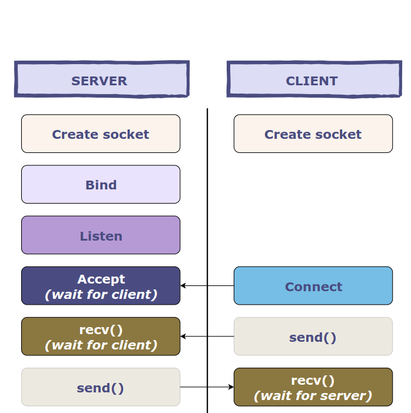

## TCP FILE TRANSFER MULTITHREADING  

### Task  
The task is to develop a protocol for transferring a randomly file from one computer to another, and write a client and server that implement this protocol. 
The server must also display the rate at which data is being received from the client.  

#### Requirements  
1. The server is passed in the parameters the port number on which it will wait for incoming connections from clients.  
2. The client is passed in the parameters a relative or absolute path to the file that needs to be sent. The file name length does not exceed 4096 bytes in UTF-8 encoding.   
The file size is no more than 1 terabyte.  
3. The client is also sent the DNS name (or IP address) and server port number in the parameters.  
4. The client sends to the server a file name in UTF-8 encoding, the file size and its contents. TCP is used for transmission. 
Come up with the transfer protocol by yourself (i.e., the programs of different students may be incompatible).
5. The server saves the received file to the uploads subdirectory of its current directory.  
 The file name, if possible, matches the name provided by the client. The server should never write outside of the uploads directory.  
6. In the process of receiving data from the client, the server should display the instantaneous reception speed and the average speed per session to the console once every 3 seconds.   
Speeds are displayed separately for each active client. If a client has been active for less than 3 seconds, the speed should still be displayed for it once.   
Speed here means the number of bytes transferred per unit of time.
7. After successfully saving the entire file, the server checks whether the size of the received data matches the size sent by the client and informs the client about the success or failure of the operation, and then closes the connection.  
8. The client should display a message indicating whether the file transfer was successful.  
9. All used OS resources should be correctly released as soon as they are no longer needed.  
10. The server must be able to work using multithreadings with several clients. 
To do this, you need to use threads (POSIX threads or their equivalent in your OS).   
Immediately after accepting a connection from one client, the server waits for further clients.  
11. If an error occurs, the server must close the connection with the client. At the same time, he must continue to serve other clients.  

### How to compile 

from dir `lab2` :  
`mkdir build`  
`cd build`  
`cmake ..`  
`make` 

Open at least 2 terminals: one for **server** and one for **client**:  
from `server's terminal` run:  
`./server <port number>`  
from `client's terminal` run:  
`./client <path to file> <DNS name or IP address> <port number>`  

### What does the project aim to?  
Multiple clients can send files to server, that stores files in `uploads` dir.   

### How this program works?  
This code uses TCP protocol.   
  

In my realisation:  
Client sends 
- file name 
- file size  
And server receives it.  

Then a client sends a file's source.  

Then server is receiving it. After full downloading server compares amount of received bytes and a file size.  
If sizes are the same, then server sends a message about it to client and a client prints it.  

